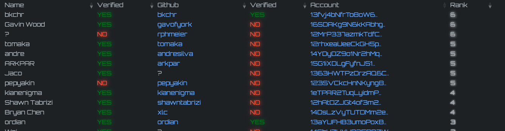

# (Inofficial) Fellowship Compliance Board

Shows compliance data for the members of the [Polkadot Fellowship](https://github.com/polkadot-fellows). Data is updated every 12hrs. Hopefully someone will create a nicer light-client app. This is just best effort until we have something nice.

# Deployment

It is a single binary without the need for a static asset directory. Build and start with:  
```bash
# If you need an SSL cert:
certbot certonly
cargo install --path .
# Allow non-sudo binaries to listen on low ports:
sudo setcap 'cap_net_bind_service=+ep' $(which fellows)
fellows --endpoint 0.0.0.0 --port 443 --cert mycert.pem --key mykey.pem
```

# Columns

Explanation for each row that you can see on [fellowship.tasty.limo](https://fellowship.tasty.limo):



## Name

The name as registered in the Polkadot identity pallet.

### Verified

Whether a valid judement was provided. Only `KnownGood` and `Reasonable` are accepted.

## Github

Whether a Github handle was detected in the additional identity data on the pallet in the Polkadot relay. 
Must be set according to this [tutorial](https://github.com/polkadot-fellows/runtimes/blob/main/docs/on-chain-identity.md).

### Verified

Whether or not the Github profile contains the Polkadot address of the Fellowship member. Valid example:  


## Address

The Polkadot address associated with the member. This is the address that is expected in the Github bio.

## Rank

The rank of the member.


# License 

The SPDX license identifier is GPL-3.0-only. See [LICENSE](LICENSE).
