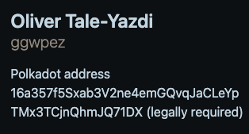

# (Inofficial) Fellowship Compliance Board

Explanation for the rows:

## Name

The name as registered in the Polkadot identity pallet.

### Verified

Whether a valid judement was provided. Only `KnownGood` and `Reasonable` are accepted.

## Github

Whether a Github handle was detected in the additional identity data on the pallet in the Polkadot relay. 
Must be set according to this [tutorial](https://github.com/polkadot-fellows/runtimes/blob/main/docs/on-chain-identity.md).

### Verified

Whether or not the Github profile contains the Polkadot address of the Fellowship member. Valid example:  

## Address

The Polkadot address associated with the member. This is the address that is expected in the Github bio.

## Rank

The rank of the member.

# License 

The SPDX license identifier is GPL-3.0-only. See [LICENSE](LICENSE).
